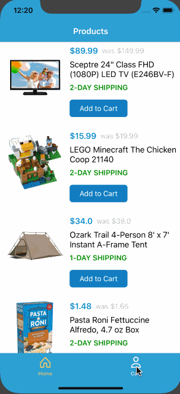

# Walmart-iOS
A sample assignment for CoderSchool

**Walmart-iOS** is a shopping app following the [Walmart Application](https://www.walmart.com/).

Time spent: **7** hours spent in total

## User Stories

The following **required** functionality is completed:

- [x] Products View (loaded from .json or hardcoded).
- [x] Can add to cart.
- [x] Cart View shows items in cart.		
- [x] Checkout View shows mock checkout view.
- [x] Thank you page says "thanks for order".

## Video Walkthrough

Here's a walkthrough of implemented user stories:

GIF created with [LiceCap](http://www.cockos.com/licecap/).

## Notes

Describe any challenges encountered while building the app.

## License

Copyright [2018] [Tri Ngo Minh]

Licensed under the Apache License, Version 2.0 (the "License");
you may not use this file except in compliance with the License.
You may obtain a copy of the License at

http://www.apache.org/licenses/LICENSE-2.0

Unless required by applicable law or agreed to in writing, software
distributed under the License is distributed on an "AS IS" BASIS,
WITHOUT WARRANTIES OR CONDITIONS OF ANY KIND, either express or implied.
See the License for the specific language governing permissions and
limitations under the License.